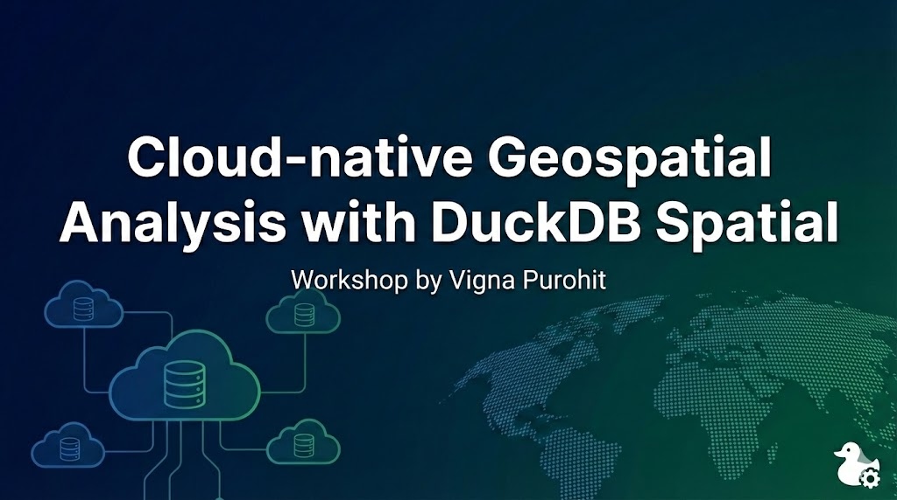

# Cloud-native Geospatial Analysis with DuckDB Spatial

<p style="text-align: center;">
  
</p>

---

## 👋 Workshop Overview

This workshop introduces **DuckDB** as a modern, analytical, cloud-native database
for **geospatial data analysis**.

We will start with DuckDB fundamentals and the CLI, understand where DuckDB fits
in today’s data ecosystem, and then move into **hands-on geospatial analytics**
using real-world datasets.  
The workshop gradually transitions from CLI → GUI → Python,
mirroring how DuckDB is used in real analytical workflows.

This material is designed to be **practical, reproducible, and infrastructure-light**.

---

## 🧭 Workshop Index

Click any section to jump directly to it.

1. [Introduction & DuckDB Architecture](#introduction--duckdb-architecture)
2. [DuckDB CLI Basics](#duckdb-cli-basics)
3. [Extensions & Spatial Setup](#extensions--spatial-setup)
4. [Working with GeoNames Data](#working-with-geonames-data)
5. [Querying & Analytics](#querying--analytics)
6. [Visualization with DBeaver](#visualization-with-dbeaver)
7. [DuckDB with Python & Cloud-Native Workflows](#duckdb-with-python--cloud-native-workflows)

---

## Introduction & DuckDB Architecture


---

### 🎯 What You Will Learn in This Workshop

By the end of this workshop, you will be able to:

- Work confidently with the **DuckDB CLI**
- Use **extensions**, including DuckDB Spatial
- Load and analyze **real-world geospatial datasets**
- Query DuckDB from **GUI tools like DBeaver**
- Integrate DuckDB with **Python for cloud-native analytics**

---

### Slides

- [View presentation slides (Google Slides)](https://docs.google.com/presentation/d/1ujZkmDi_vmrOjBzIXTVBLhYzNFyJhN9CwEY77IWPZSg/edit?usp=sharing)

---


## 🛠 Installation & Setup (One-time)

This workshop is designed to be **lightweight**.  
You only need DuckDB to get started. Other tools are optional but recommended.

---

### 🦆 DuckDB CLI (Required)

DuckDB is an embedded analytical database that runs locally as a single binary.

| Platform | Method | Command / Link |
|--------|--------|----------------|
| **macOS** | Homebrew | `brew install duckdb` |
|  | One-liner | `curl https://install.duckdb.org \| sh` |
| **Linux** | One-liner | `curl https://install.duckdb.org \| sh` |
| **Windows** | Download | https://duckdb.org/docs/installation |
| **Docker** (optional) | Container | `docker run -it duckdb/duckdb` |

📘 Official documentation:  
https://duckdb.org/docs/installation

---

### 🖥 DBeaver (Recommended – GUI)

DBeaver is a free database GUI used in this workshop to **browse tables and run queries visually**.

- Download DBeaver Community Edition:  
  https://dbeaver.io/download/

After installation:
1. Open DBeaver  
2. Create a new connection  
3. Select **DuckDB**  
4. Open the `.duckdb` file created during the workshop  

_No server, username, or password required._

---

### 📓 Google Colab (Required)

For the Python section, you can use **Google Colab**:
- Runs entirely in the browser
- No local Python installation required

Google Colab:
- https://colab.research.google.com/

Ready-to-run Colab notebooks will be linked later in this workshop.


Markdown Output
Your converted Markdown document, Preview of your Markdown content:
## 🖥 DuckDB CLI Warm-up (In-Memory Exploration)

In this warm-up, we use DuckDB without creating a database file.

All queries run in memory and disappear when DuckDB exits.

#### Start DuckDB

```sql duckdb```

DuckDB starts without creating a database file.

#### Basic Interaction

```sql SELECT 1;```

```sql SELECT current_timestamp;```

#### DuckDB extensions:

```sql SELECT * FROM duckdb_extensions();```

Install and load the extensions used in this workshop:

```sql INSTALL spatial```;

```sql LOAD spatial```;

```sql INSTALL httpfs```;

```sql LOAD httpfs```;

Verify that the Spatial extension is active:

```sql SELECT ST_Point(77.2, 28.6)```;

#### Create a small table using inline values:

```sql CREATE TABLE demo AS
SELECT * FROM (VALUES
(1, 'Alice'),
(2, 'Bob'),
(3, 'Charlie')
t(id, name);
```

Query the table:

```sql SELECT * FROM demo```;

Run a simple analytical query:

```sql SELECT
COUNT(*) AS rows,
MIN(id) AS min_id,
MAX(id) AS max_id
FROM demo;
```

#### Read a Local Excel File

```sql SELECT *
FROM read_excel(
'data/sample.xlsx',
sheet='Sheet1'
)
LIMIT 5;
````

####Read a Google Sheet (Public Link)

Make the Google Sheet public (Viewer access) and use its URL:

```sql SELECT * FROM 
(https://docs.google.com/spreadsheets/d/<SHEET_ID>/export?format=csv')
LIMIT 5;
```
#### Exit DuckDB CLI

```sql .quit ```

Restart DuckDB without a database file, and all in-memory data is cleared.

##🗄 Create a DuckDB Database

#### 📥 Download GeoNames Cities Data

We will use the data from [GeoNames](https://www.geonames.org/). It is a geographical 
database covers all countries and contains over eleven million placenames that are 
available for download free of charge.
We will be downloading files of some asian countries like India,China, Japan, Indonesia and Thailand which are - IN.zip, CN.zip, JP.zip, ID.zip and TH.zip. Also, the readme.txt file is required to get the headers. You can download all these required datasets for the workshop using the link below.
[Download Data](assets/data/data.zip)

#### CLI Workflow

Start DuckDB and create a persistent database file.

```sql duckdb geonames_asia.ddb ```

Now, we are going to merge the downloaded geonames file in a single step by creating memory table ``geonames_raw``.

```sql
CREATE TABLE geonames_raw AS
SELECT *
FROM read_csv(
  [
    'data/IN.txt',
    'data/CN.txt',
    'data/JP.txt',
    'data/ID.txt',
    'data/TH.txt'
  ],
  delim = '\t',
  header = false
);
``` 
Let's inspect the table. Here, DuckDB shows us the schema it inferred from the data files.

```sql DESCRIBE geonames_raw; ```

Output 
| Field         |  explanation                                                         |

| ------------- | ---------------------------------------------------------------------------- |

| `column_name` | Name of the column (auto-generated when source data has no header).          |

| `column_type` | Data type inferred automatically by DuckDB from the loaded data.             |

| `null`        | Indicates whether the column allows NULL values (`YES` means NULLs allowed). |

| `key`         | Shows key constraints such as PRIMARY KEY (NULL means no key defined).       |

| `default`     | Default value for the column (NULL means no default is set).                 |

| `extra`       | Reserved metadata field; typically unused in DuckDB. 


In the next step, we will assign the headers as provided in the readme.txt file.

```sql
ALTER TABLE geonames_raw RENAME COLUMN column00 TO geonameid;
ALTER TABLE geonames_raw RENAME COLUMN column01 TO name;
ALTER TABLE geonames_raw RENAME COLUMN column02 TO asciiname;
ALTER TABLE geonames_raw RENAME COLUMN column03 TO alternatenames;
ALTER TABLE geonames_raw RENAME COLUMN column04 TO latitude;
ALTER TABLE geonames_raw RENAME COLUMN column05 TO longitude;
ALTER TABLE geonames_raw RENAME COLUMN column06 TO feature_class;
ALTER TABLE geonames_raw RENAME COLUMN column07 TO feature_code;
ALTER TABLE geonames_raw RENAME COLUMN column08 TO country_code;
ALTER TABLE geonames_raw RENAME COLUMN column09 TO cc2;
ALTER TABLE geonames_raw RENAME COLUMN column10 TO admin1_code;
ALTER TABLE geonames_raw RENAME COLUMN column11 TO admin2_code;
ALTER TABLE geonames_raw RENAME COLUMN column12 TO admin3_code;
ALTER TABLE geonames_raw RENAME COLUMN column13 TO admin4_code;
ALTER TABLE geonames_raw RENAME COLUMN column14 TO population;
ALTER TABLE geonames_raw RENAME COLUMN column15 TO elevation;
ALTER TABLE geonames_raw RENAME COLUMN column16 TO dem;
ALTER TABLE geonames_raw RENAME COLUMN column17 TO timezone;
ALTER TABLE geonames_raw RENAME COLUMN column18 TO modification_date;
```

Now, let's rename the table to the meaningful one.

```sql
ALTER TABLE geonames_raw RENAME TO geonames_asia; 
```
Let's count records per country.

```sql
SELECT country_code COUNT(*) AS records
FROM geonames_asia
GROUP BY country_code
ORDER BY records DESC;
```

#### DBeaver Workflow

Once we open the table, we see important `feature_class` and `feature_code` columns which makes the GeoNames flexible enough to query the features based on broader categories like populated aread, water, mountains etc using the `feature_class` column and deeper catogories like different levels of admin boundaries, farm village etc using the `feature_code` column.

Let's see all the feature classes and records associate with each one of those.

```sql
SELECT
  feature_class,
  COUNT(*) AS records
FROM geonames_asia
GROUP BY feature_class
ORDER BY records DESC;
```

Further let's try by selecting populated class and view it in descending order of the population.

```sql
SELECT name,country_code,population
  FROM geonames_asia
  WHERE feature_class = 'P'
  ORDER BY population DESC
```
Finally, we will export this data as a parquet file. Let's just select required raws and export the data to parquet.

```sql
COPY (
  SELECT
    geonameid,
    name,
    country_code,
    feature_class,
    population,
    latitude,
    longitude
  FROM geonames_asia
  WHERE feature_class = 'P'
)
TO '/Path To Folder/geonames_asia_cities.parquet'
(FORMAT PARQUET);
```
Note: You can directly write the parquet file to Doogle Cloud with the right setup. If you have enabled the GCS storage, you can try the following workflow.

-- Step 1: Install and load httpfs extension

INSTALL httpfs;

LOAD httpfs;

-- Step 2: Create GCS secret with HMAC keys

(Get HMAC keys from: [GCS Console)](https://console.cloud.google.com/storage/settings;tab=interoperability))

```sql 
CREATE SECRET my_gcs_secret (
TYPE GCS,
KEY_ID 'GOOG1EXXXXXXXXXXXXX',
SECRET 'your-secret-access-key-here');
```

-- Step 3: Write Parquet with selected columns directly to GCS

```sql
COPY (
    SELECT
      geonameid,
      name,
      country_code,
      population,
      latitude,
      longitude
    FROM geonames_asia
    WHERE feature_class = 'P'
  )
  TO 'gs://foss4g_workshop/geonames_asia_cities.parquet'
  (FORMAT PARQUET);
```

